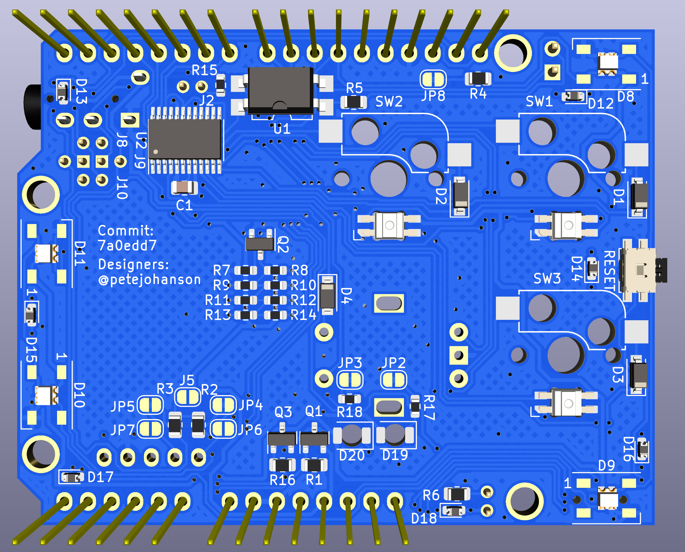

# ZMK Uno




The ZMK Uno shield is an OSH shield for the Arduino Uno Rev3 interface, making it compatible with any compatible dev kit, such as the Nordic 52840 DK, ST Nucleo 64 kits, etc.

The goal is to create a standard hardware target for testing and development of ZMK, as well as a supported sample hardware for anyone to evaluate ZMK's feature before committing to use it for their designs.

# Goals

The ZMK Uno has the following goals:

* Include all commonly found ZMK keyboard hardware
* Allow adding additional hardware beyond that for further development.
* Be low cost
* Be hand solderable, or possible to get mostly assembled by JLC and other budget manufacturers

# Hardware Features

The goal of ZMK Uno is to contain the common, or actively supported hardware found on the many keyboards, while also offering continued expansion (e.g. using a half-width shield/hat over it) for addition custom hardware to be developed/tested.

## Switches

ZMK Uno contains 4 switches (one of which is an EC11 encoder w/ click functionality), that can be configured either in a 2x2 matrix, or 4-wire direct wire confugration using the jumpers in the top right corner.

## Encoder

A single EC11 encoder is included, allowing testing of encoder/sensor behavior in ZMK.

## Power Cutoff

Many wireless designs (e.g. nRFMicro, nice!nano) include the ability to cut off the VCC power to save power, especially for keyboards with addressable RGB LEDs which have a high quiescent current. The ZMK Uno shield includes *two* MOSFETs, creating a toplevel "power domain" that both the SSD1306 OLED and second MOSFET are connected two. The second MOSFET is a "sub-power domain" of the first one, and contains the RGB LEDs for the underglow and per-key LEDs. Doing so allows testing more complex power domain scenarios, and allows you to cut power to the RGB while still allowing the OLED to stay powered. The second MOSFET can also be *ignored* since its default state is open, and you can treat the system as just having on toplevel power domain, which matches devices like the nice!nano, nRFMicro, etc.

## Display

A standard header for the common SSD1306 i2c OLED modules is including, allowing testing of the ZMK display functionality.

The display VCC pin is connected to the VCC line behind the toplevel power-domain.

## LEDs

Both underglow, and per-key RGB LEDs are included in the ZMK Uno shield. Currently, only underglow is supported by ZMK, but the per-key RGB hardware is included for possible future development/testing.

All LED power pins are connected to the RGB sub-power domain for their power.

## TRRS

ZMK does not currently support wired split designs, however to support any future efforst to add that support, the ZMK Uno includes a standard TRRS jack, which can be configured using pin jumpers to use either serial or I2C pins. In addition, an optional pull up can be enabled with a jumper, for testing single-wire half duplex serial mode.

# Contributing

ZMK Uno uses KiCad nightly. After fetching the repository, be sure to run:

```
git submodule update --init
```

To fetch the various footprint libraries used by the project.

# Bill Of Materials

| Quantity | Description                    | LCSC #           | Mfr Part Number                           |
| -------- | ------------------------------ | ---------------- | ----------------------------------------- |
| 3        | Kailh Hotswap Socket           | N/A              | CPG151101S11                              |
| 3        | MX Switches                    |                  |                                           |
| 1        | Rotary Encoder                 |                  | EC11                                      |
| 4        | Diodes                         | C81598           | 1N4148W                                   |
| 3        | Switch Mode Selection Headers  |                  | 1x8 2mm pitch pin headers                 |
| 1        | Reset Button                   | C79174           | EVQPUC02K                                 |
| 11       | Pin Jumpers For Mode Selection |                  | 2mm-pitch pin jumpers (e.g. SPN02SXCN-RC) |
| 1        | LED Resistor                   |                  | 500Ω (0805)                               |
| 1        | Power Cutoff Resistor          |                  | 2MΩ (0805)                                |
| 1        | Power Cutoff MOSFET            | C15127           | AO3401A                                   |
| 4        | Underglow RGB LEDs             | C2761795/C965555 | WS2812B/WS2812B-2020                      |
| 3        | Per-Key RGB LEDs               | C9900001298      | SK6812MINI-E                              |
| 1        | I2C Pullup Header              |                  | 1x2 2mm pitch pin headers                 |
| 2        | I2C Pullup Resistors           |                  | 10kΩ (0805)                               |
| 1        | 128x64 I2c OLED Module         |                  |                                           |
| 1        | TRRS Pin Selection Header      |                  | 1x4 2mm pitch pin headers                 |
| 2        | TRRS Pin Selection Headers     |                  | 1x2 2mm pitch pin headers                 |
| 1        | TRRS Jack                      |                  | PJ320A                                    |
| 1        | Latency Tester Resistor        |                  | 150Ω (0805)                               |
| 1        | Latency Tester Optocoupler     | C106900          | EL817S1                                   |

