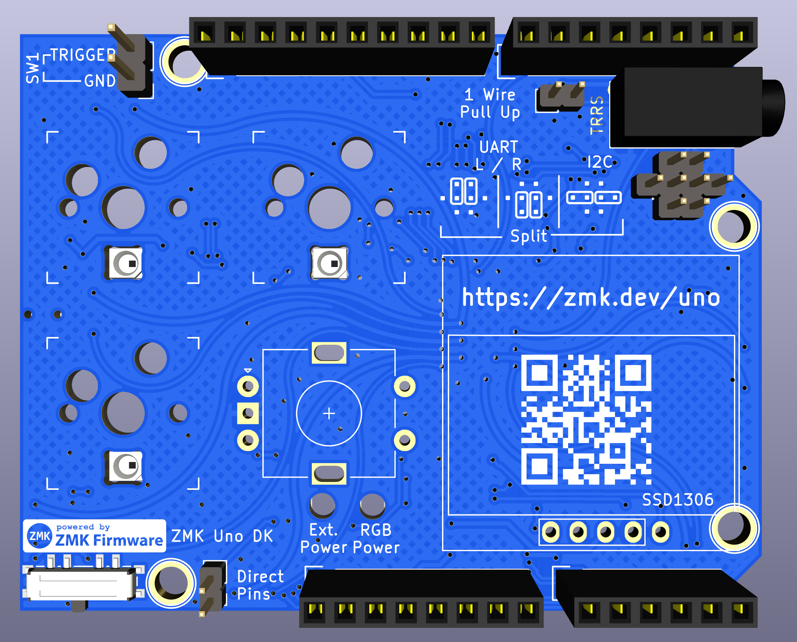

# ZMK Uno




The ZMK Uno shield is an OSH shield for the Arduino Uno Rev3 interface, making it compatible with any compatible dev kit, such as the Nordic 52840 DK, ST Nucleo 64 kits, etc.

The goal is to create a standard hardware target for testing and development of ZMK, as well as a supported sample hardware for anyone to evaluate ZMK's feature before committing to use it for their designs.

# Goals

The ZMK Uno has the following goals:

* Include all commonly found ZMK keyboard hardware
* Allow adding additional hardware beyond that for further development.
* Be low cost
* Be hand solderable, or possible to get mostly assembled by JLC and other budget manufacturers

# Hardware Features

The goal of ZMK Uno is to contain the common, or actively supported hardware found on the many keyboards, while also offering continued expansion (e.g. using a half-width shield/hat over it) for addition custom hardware to be developed/tested.

## Switches

ZMK Uno contains 4 switches (one of which is an EC11 encoder w/ click functionality), that can be configured either in a 2x2 matrix, or 4-wire direct wire confugration using the jumpers in the top right corner.

## Encoder

A single EC11 encoder is included, allowing testing of encoder/sensor behavior in ZMK.

## Power Cutoff

Many wireless designs (e.g. nRFMicro, nice!nano) include the ability to cut off the VCC power to save power, especially for keyboards with addressable RGB LEDs which have a high quiescent current. The ZMK Uno shield includes a MOSFET design for the same VCC cutoff, to test this functionality.

## Display

A standard header for the common SSD1306 i2c OLED modules is including, allowing testing of the ZMK display functionality.

the display VCC pin is connected to the VCC line behind the power cufoff.

## LEDs

Both underglow, and per-key RGB LEDs are included in the ZMK Uno shield. Currently, only underglow is supported by ZMK, but the per-key RGB hardware is included for possible future development/testing.

All LED power pins are connected to the VCC line behind the power cufoff.

## TRRS

ZMK does not currently support wired split designs, however to support any future efforst to add that support, the ZMK Uno includes a standard TRRS jack, which can be configured using pin jumpers to use either serial or I2C pins.

# Contributing

ZMK Uno uses KiCad nightly. After fetching the repository, be sure to run:

```
git submodule update --init
```

To fetch the various footprint libraries used by the project.
